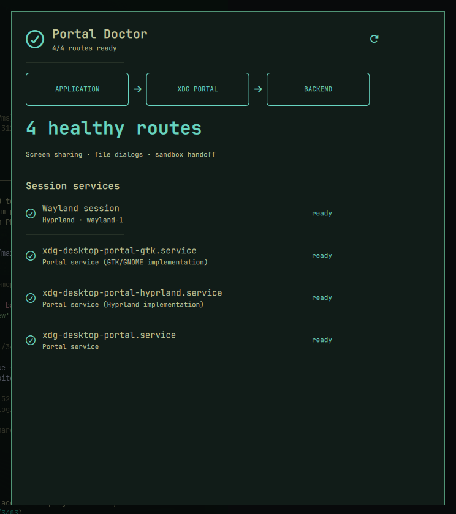

# Portal Doctor

[](https://github.com/AdamMusa/omarchy-ui)
[](LICENSE)

**See which desktop portal actually handles screenshots, sharing, and file dialogs.**

Portal Doctor inventories the active XDG portal services and the Wayland desktop identity they use, making missing, duplicated, or inactive backends visible without changing the session.



## Why this is distinct

Captive-portal widgets diagnose network login pages. Portal Doctor inspects Linux desktop portals—the user-session services behind screen sharing, file pickers, and sandbox integration.

The concept was checked against the complete Omarchy Plugin Marketplace catalog before development.

## Install

```bash
omarchy plugin add https://github.com/AdamMusa/omarchy-portal-doctor.git --enable
```

The repository is self-contained. Omarchy UI asks Zui 0.0.10 to tree-shake the QML renderer at
bundle time, so users do not need Ruby or framework gems on the destination.

Review third-party plugin code before enabling it. Omarchy community plugins run with your user account.

## Use

Add **Portal Doctor** to the Omarchy bar and click its widget to open the panel. The plugin is keyboard-friendly, theme-aware, and designed for a 660 × 760 panel.

## Data, permissions, and safety

- Local state: `~/.local/state/omarchy-portal-doctor/state.json`
- State, command output, item counts, history, and rendered strings are bounded.
- State writes use an owner-only temporary file and atomic rename.
- System probes are read-only and invoke fixed argument arrays without a shell.

- No telemetry, analytics, remote account, package installation, or privileged command is used.
- The plugin never overwrites Omarchy, Hyprland, or application configuration.

External runtime tools are limited to standard commands already present on Omarchy when a feature needs them. Missing optional commands degrade to an explicit unavailable state. The exact commands are visible in [`lib/backend.rb`](lib/backend.rb).

## Remove

```bash
omarchy plugin remove izeesoft.portal-doctor
```

Removal leaves the local state file in place so reinstalling preserves history. To erase it too:

```bash
rm -r ~/.local/state/omarchy-portal-doctor
```

## Marketplace metadata

- Plugin ID: `izeesoft.portal-doctor`
- Category: System
- Tags: system, quickshell, bar
- Kinds: service, bar widget, panel
- Target: Omarchy Quattro on x86-64 Linux

## License

MIT.
